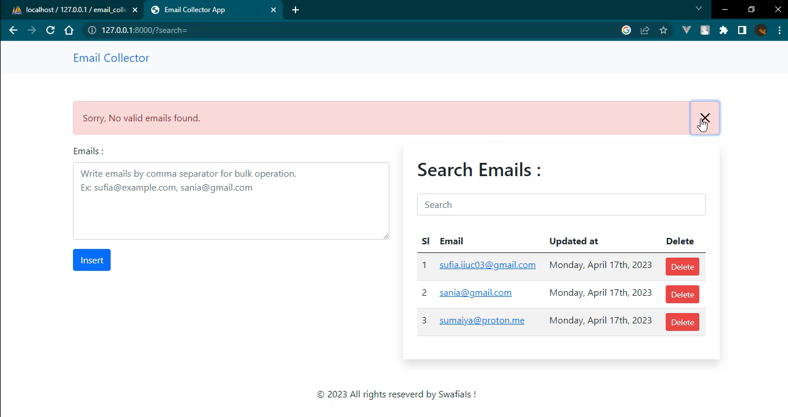

### A Mini Email Collector App
A user can insert single email or more than one with comma separator , only valid email will be added in database also user can see the list of email in right side of the user end so , user can search email address from there or can delete from that list also can   mail to the address.

###### User Interface : 

____

#### Functionality : 
- Bulk insertion / single insertion using insert() method.
- Validate an email address with PHP function filter_var() .
- Show Success/Error message or Delete Confirmation Box via RealRashid - SweetAlert Package .
- Direct Mail To option from client end .
- Search email address .

##### Technology : 
- Laravel1o  
- PHP8 
- Mysql 
- html 
- css 
- Bootstrap5 
- Jquery AJAX.

__Here is simple video of my app [workflow !](https://youtu.be/HKRdjE1A5AI)__